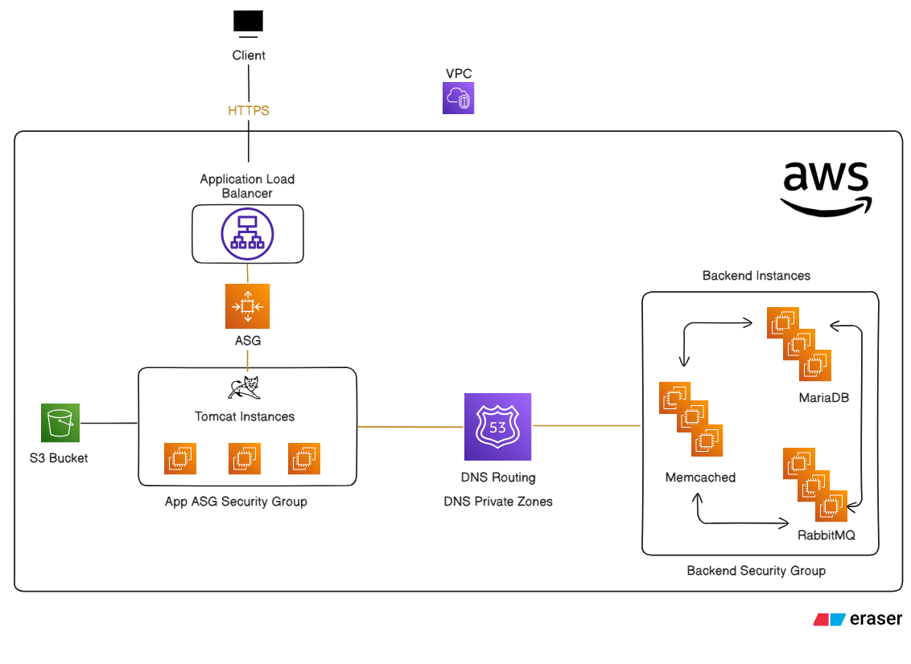

# ☁️ Java Application Deployment on AWS

 <!-- Replace with your actual diagram image URL -->

## 📘 Project Overview

This project demonstrates how to deploy a Java-based web application on AWS using various cloud-native services. The setup ensures high availability, scalability, and security.

The application is hosted on **EC2 instances running Tomcat**, behind a **load balancer**, and communicates with a **backend stack** consisting of a database, caching, and messaging queue.

---

## 🚀 AWS Services Used

- **EC2** – Compute instances to host the application and backend services.
- **Auto Scaling Group (ASG)** – Automatically scales instances based on demand.
- **Elastic Load Balancer (ALB)** – Distributes HTTPS traffic to application instances.
- **S3** – Stores application artifacts and deployment packages.
- **Route 53** – Manages DNS and domain routing.
- **VPC & Subnets** – Provides a secure and isolated network environment.
- **Security Groups** – Controls inbound and outbound traffic to resources.

---

## 🏗️ Infrastructure Details

### ✅ VPC and Subnets
- Custom VPC with public and private subnets.
- Internet Gateway and NAT Gateway configured for access and updates.

### ✅ Security Groups
- **ALB Security Group** – Allows HTTPS (port 443) access from the internet.
- **Application SG** – Allows traffic from the ALB on port 8080.
- **Backend SG** – Allows internal communication between backend services and from application instances.

### ✅ Backend Services
- **MariaDB** – Relational database for persistent data storage.
- **Memcached** – In-memory caching system for reducing DB load.
- **RabbitMQ** – Queue system for handling background tasks and async jobs.

---

## 🌐 Application Access

- The Java web application is accessible via:
